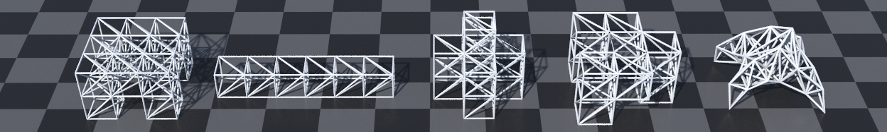

# SNMT


## Installation
```pip install -r requirements.txt```

## Train
```python3 main_diff_phy.py --config_file cfg3d/sim_quad.json --train```

```python3 main_diff_phy.py --config_file cfg3d/sim_spider.json --train```

## View train statstic
```tensorboard --logdir saved_results/sim_quad```

```tensorboard --logdir saved_results/sim_spider```

## Interactive control
```python3 interactive_3d.py --config_file cfg3d/sim_quad.json --no-tensorboard```

```python3 interactive_3d.py --config_file cfg3d/sim_spider.json --no-tensorboard```

## Evaluate
```python3 main_diff_phy.py --config_file cfg3d/sim_quad.json --evaluate --no-tensorboard --evaluate_path saved_results/sim_quad/DiffTaichi_DiffPhy```

```python3 main_diff_phy.py --config_file cfg3d/sim_spider.json --evaluate --no-tensorboard --evaluate_path saved_results/sim_spider/DiffTaichi_DiffPhy```

